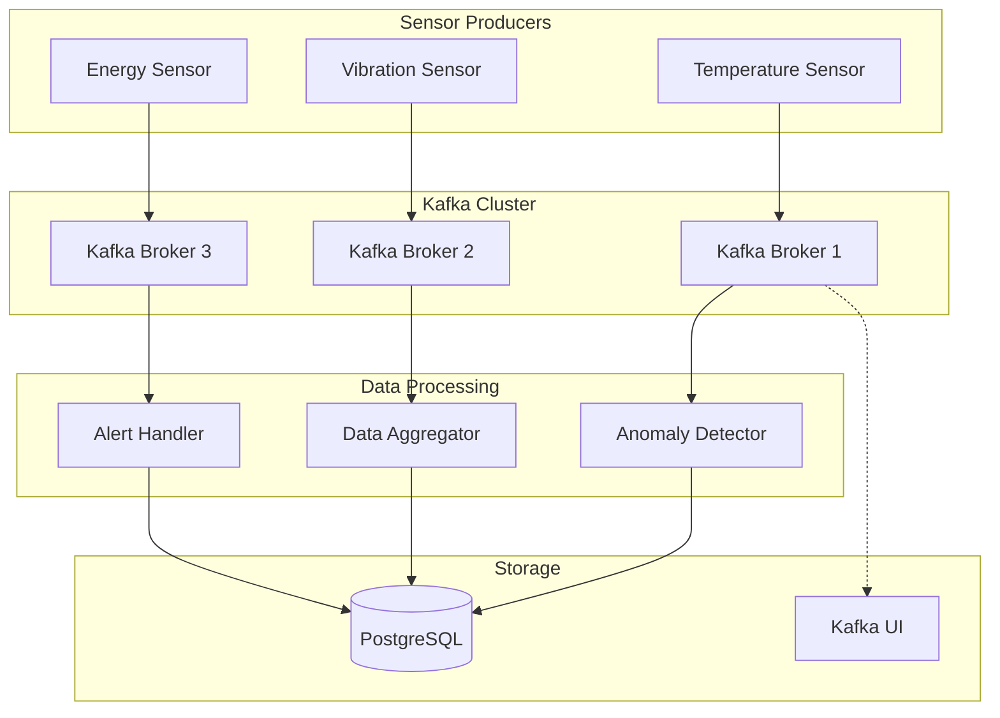

# Factory Monitoring System 🏭

A distributed sensor monitoring system for smart factories using **Apache Kafka**, **Docker**, and **Python**. This project implements a scalable IoT data processing pipeline following modern distributed systems patterns.

## 🎯 Project Overview

This system simulates and monitors sensor data from a smart factory environment, processing real-time data streams to detect anomalies and generate alerts. The architecture demonstrates key distributed systems concepts including:

- **Event-driven architecture** with Apache Kafka
- **Containerized microservices** with Docker
- **Real-time data processing** and anomaly detection
- **Scalable producer-consumer patterns**

## 🏗️ Architecture



## 🚀 Quick Start

### Prerequisites

- Docker & Docker Compose v2
- Make (for convenience commands)
- Python 3.11+ (for local development)

### 1. Start Infrastructure

```bash
# Initialize and start Kafka cluster + PostgreSQL
make start

# Verify cluster health
make health
```

### 2. Start Sensor Producers

```bash
# Build and start all sensor producers
make build-sensors
make start-sensors

# Or start everything at once
make full-start
```

### 3. Monitor Real-time Data

```bash
# View sensor logs
make logs-sensors

# Monitor sensor data stream
make monitor-sensors

# Open Kafka UI (http://localhost:8080)
make monitor
```

## 📊 System Components

### Sensor Producers

**Single Unified Producer** (`src/producers/sensor_producer.py`):
- **Environment-driven configuration**: Change sensor type via `SENSOR_TYPE` env var
- **Multiple sensor types**: temperature, vibration, energy, humidity, pressure
- **Realistic data simulation**: Time-based patterns, noise, anomalies
- **Alert generation**: Automatic warning/critical threshold detection
- **Configurable sampling**: Different intervals per sensor type

**Example sensor data**:
```json
{
  "timestamp": "2025-09-16T21:41:41.011144Z",
  "sensor_id": "temp-sensor-001",
  "sensor_type": "temperature", 
  "location": {
    "factory_section": "production",
    "machine_id": "machine-001",
    "zone": "zone-a"
  },
  "value": 42.48,
  "unit": "°C",
  "alert_level": "critical",
  "quality": 1.0,
  "metadata": {
    "reading_count": 14,
    "warning_threshold": 35.0,
    "critical_threshold": 40.0
  }
}
```

### Kafka Infrastructure

**3-Node KRaft Cluster**:
- **Modern Kafka**: No ZooKeeper dependency (KRaft mode)
- **High availability**: 3 brokers with replication factor 2
- **Topics**: `sensor-data` (3 partitions), `alerts` (2 partitions)
- **External access**: Ports 9092, 9094, 9096

### Data Storage

- **PostgreSQL 15**: Processed data and alerts
- **Kafka UI**: Real-time cluster monitoring (port 8080)

## 🛠️ Development Commands

| Command | Description |
|---------|-------------|
| `make help` | Show all available commands |
| `make start` | Start infrastructure only |
| `make full-start` | Start infrastructure + sensors |
| `make stop` | Stop all services |
| `make clean` | Remove containers and volumes |
| `make status` | Check service status |
| `make health` | Check service health |
| `make build-sensors` | Build sensor images |
| `make start-sensors` | Start sensor producers |
| `make stop-sensors` | Stop sensor producers |
| `make logs-sensors` | View sensor logs |
| `make monitor-sensors` | Monitor real-time data |
| `make monitor` | Open Kafka UI |

## ⚙️ Configuration

### Sensor Configuration

Each sensor type has predefined realistic ranges and thresholds:

```python
sensor_configs = {
    "temperature": {
        "base_value": 25.0,      # °C
        "warning_threshold": 35.0,
        "critical_threshold": 40.0,
        "sampling_interval": 3.0  # seconds
    },
    "vibration": {
        "base_value": 2.0,       # mm/s  
        "warning_threshold": 5.0,
        "critical_threshold": 7.0,
        "sampling_interval": 4.0
    },
    "energy": {
        "base_value": 100.0,     # kW
        "warning_threshold": 150.0, 
        "critical_threshold": 180.0,
        "sampling_interval": 10.0
    }
}
```

### Environment Variables

```bash
# Sensor Configuration
SENSOR_ID=temp-sensor-001
SENSOR_TYPE=temperature
SAMPLING_INTERVAL=3.0
FACTORY_SECTION=production
MACHINE_ID=machine-001
ZONE=zone-a

# Kafka Configuration  
KAFKA_BROKERS=kafka1:29092,kafka2:29092,kafka3:29092
SENSOR_TOPIC=sensor-data
```

## 📈 Data Flow & Alert System

### Alert Levels
- **Normal**: Value within expected range
- **Warning**: 15% probability, value near warning threshold  
- **Critical**: 5% probability, value near/above critical threshold

### Real-time Processing
1. Sensors generate readings every 3-10 seconds
2. Data published to Kafka `sensor-data` topic
3. Consumers process data for anomaly detection
4. Alerts generated for threshold violations
5. Processed data stored in PostgreSQL

## 🧪 Testing & Verification

```bash
# Test Kafka connectivity
make test-external

# Test topic operations
make test-topics

# Comprehensive cluster verification
make verify-cluster

# Monitor specific sensor type
docker compose logs -f temperature-sensor
```

## 📂 Project Structure

```
.
├── src/
│   └── producers/
│       └── sensor_producer.py      # Unified sensor simulator
├── docker/
│   ├── Dockerfile.producer         # Sensor container image
│   └── Dockerfile.tester           # Testing utilities
├── docker-compose.yml              # Multi-service orchestration
├── Makefile                        # Development commands
├── requirements.txt                # Python dependencies
└── README.md                       # This file
```

## 🎯 Development Phases

- [x] **Phase 1**: Infrastructure Setup (Kafka KRaft + PostgreSQL)
- [x] **Phase 2**: Topic Configuration & Verification  
- [x] **Phase 3**: Sensor Producers Implementation
- [ ] **Phase 4**: Data Consumers & Processing
- [ ] **Phase 5**: Anomaly Detection System
- [ ] **Phase 6**: Alert Management & Notifications
- [ ] **Phase 7**: Performance Optimization
- [ ] **Phase 8**: Integration Testing & Documentation

## 🚀 Next Steps

1. **Implement Data Consumers**: Create consumer services for real-time processing
2. **Add Anomaly Detection**: Machine learning-based anomaly detection
3. **Build Alert System**: Email/SMS notifications for critical alerts
4. **Performance Monitoring**: Add metrics and monitoring dashboards
5. **Scaling**: Load testing and horizontal scaling strategies

## 🤝 Contributing

This is an educational project for distributed systems learning. Feel free to:
- Experiment with different sensor configurations
- Add new sensor types
- Implement consumer patterns
- Optimize performance

## 📄 License

Educational project - feel free to use for learning purposes.